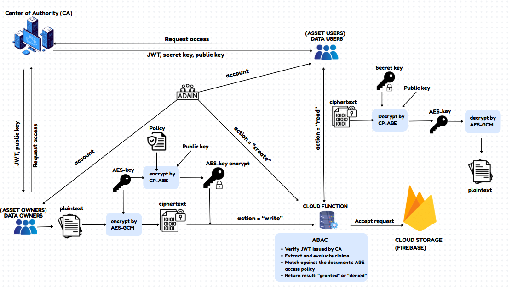

# **Cryptography-Project**
---

## **📌 Description**
This project provides a secure data sharing system that enables organizations to encrypt, store, and control access to sensitive documents using a combination of symmetric encryption (**AES-GCM**), attribute-based encryption (**CP-ABE**), and **JSON Web Tokens (JWT)** for authentication and access control.

The system is designed to meet real-world enterprise needs, where documents must be shared among users with different roles, departments, and privileges — while preventing unauthorized access, even from cloud service providers.

---

## **🚀 Key Features**

- **End-to-end encryption**  
  Documents are encrypted on the client side using AES-GCM, ensuring both confidentiality and integrity.

- **Fine-grained access control**  
  The AES key is encrypted using CP-ABE with a custom policy, allowing only users whose attributes satisfy the policy to decrypt the data.

- **Attribute-based access (ABAC)**  
  Supports flexible, dynamic permission management based on user attributes (e.g., role, department).

- **Secure key distribution**  
  The Certificate Authority (CA) issues CP-ABE secret keys only after verifying the user's identity and attributes through a signed JWT.

- **JWT-based authentication**  
  JWTs are signed using **ECDSA**, verified server-side, and used to authenticate users and securely authorize access.

- **Cloud integration**  
  Uses **Google Cloud Functions** for verifying requests and enforcing access policies, and **Firebase** for metadata and encrypted data storage.

---

## **🧪 Technologies Used**

- **Charm-Crypto** – CP-ABE encryption (AC17 scheme)  
- **PyCryptodome** – AES-GCM symmetric encryption  
- **PyJWT** – JWT signing and verification  
- **OpenSSL** – Certificate & key management (used by CA)  
- **Firebase Admin SDK** – Firestore, Authentication, Storage  
- **tkinter** – GUI for client application  

This system demonstrates a practical implementation of attribute-based encryption in cloud environments, ensuring strong guarantees of privacy, access control, and data integrity.

---

## **📐 Architecture Diagram**

---

## **🎥 Demo**

[▶ Watch Demo on Google Drive](https://drive.google.com/file/d/1Ye6jNHj0Rb4mE2pladXWWg8_LpPnT0ya/view?usp=sharing)

---
